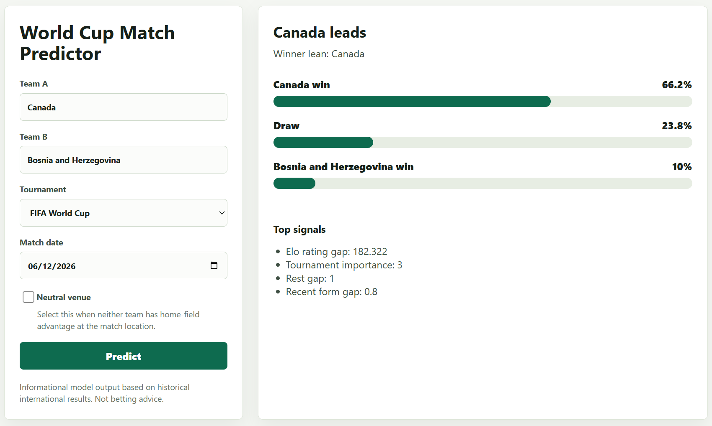

# World Cup Match Predictor

Predict men's senior international soccer match outcomes from two team names. The app trains on public international results, exports a model artifact, exposes a FastAPI API, and serves a small single-page frontend.

The predictions are informational and are not betting advice.

## UI Preview



## 2026 World Cup Schedule

The FIFA World Cup 2026 runs from **June 11 to July 19, 2026**, across Canada,
Mexico, and the United States. FIFA lists **104 matches**: 72 group-stage matches
and 32 knockout matches.

Official schedule sources:

- [FIFA match schedule and fixtures](https://www.fifa.com/en/articles/match-schedule-fixtures-results-teams-stadiums)
- [FIFA match schedule PDF](https://digitalhub.fifa.com/m/1be9ce37eb98fcc5/original/FWC26-Match-Schedule_English.pdf)

Tournament phase dates:

| Phase | Dates |
| --- | --- |
| Group stage | June 11-27, 2026 |
| Round of 32 | June 28-July 3, 2026 |
| Round of 16 | July 4-7, 2026 |
| Quarter-finals | July 9-11, 2026 |
| Semi-finals | July 14-15, 2026 |
| Third-place match | July 18, 2026 |
| Final | July 19, 2026 |

The local dataset currently includes the 2026 group-stage fixture rows. Completed
scores become available only after the upstream data source adds match results.

## World Cup Predictions

Daily prediction tables have moved to [predictions.md](predictions.md) to keep
this README focused on the app and setup workflow.

Latest generated on **June 24, 2026** with model `hgb_iter80_lr0.03_l20`.
Current accuracy on completed tracked predictions: **62.2%** (28 correct out of
45).

## Data

Primary data source: [martj42/international_results](https://github.com/martj42/international_results), a CC0 dataset of men's full international football results. The training pipeline uses `results.csv`; shootout data is downloaded for future extensions but v1 predicts the full-time/extra-time result class: team A win, draw, or team B win.

## Local Setup

### Easy Install

Windows 11, from PowerShell:

```powershell
.\scripts\install_windows.ps1
```

Linux, from Bash:

```bash
chmod +x scripts/install_linux.sh
./scripts/install_linux.sh
```

On a fresh Ubuntu, Debian, RedHat, Fedora, CentOS, or Rocky Linux machine, include
`--system-deps` so the script installs Python/build prerequisites with the native
package manager:

```bash
./scripts/install_linux.sh --system-deps
```

Useful options for both installers:

| Option | Purpose |
| --- | --- |
| `--dev` / `-Dev` | Install test and lint tools. |
| `--download-data` / `-DownloadData` | Refresh `data/raw` from the configured source. |
| `--train-model` / `-TrainModel` | Retrain `artifacts/model.joblib`. |
| `--run-checks` / `-RunChecks` | Run formatting, linting, and tests after install. |

After installation, start the frontend/API:

```powershell
.\.venv\Scripts\python -m uvicorn worldcup_predictor.app:app --reload
```

On Linux:

```bash
.venv/bin/python -m uvicorn worldcup_predictor.app:app --reload
```

Open `http://127.0.0.1:8000`.

### Cleanup

Default cleanup removes the local virtual environment, Python caches, pytest cache,
and build metadata. It does not remove source code, committed model artifacts, raw
data, or prediction logs.

Windows 11, from PowerShell:

```powershell
.\scripts\cleanup_windows.ps1
```

Linux, from Bash:

```bash
./scripts/cleanup_linux.sh
```

Cleanup options:

| Option | Purpose |
| --- | --- |
| `--dry-run` / `-DryRun` | Print what would be removed without deleting anything. |
| `--data` / `-Data` | Also remove ignored raw data, `results.tsv`, and `*.log` files. |
| `--artifacts` / `-Artifacts` | Also remove generated model/research artifacts while keeping `.gitkeep`. |
| `-ForceAcl` | Windows only: repair ownership/ACLs for stubborn cleanup directories before retrying; may require Administrator PowerShell. |
| `--all` / `-All` | Run default cleanup plus data/log and artifact cleanup. |

### Manual Setup

```powershell
python -m venv .venv
.\.venv\Scripts\python -m pip install -e .
.\.venv\Scripts\python scripts/download_data.py
.\.venv\Scripts\python scripts/train_model.py
.\.venv\Scripts\python -m uvicorn worldcup_predictor.app:app --reload
```

Open `http://127.0.0.1:8000`.

## Quality Checks

This project enforces Python linting and formatting with Ruff using Google-style docstring rules:

```powershell
python -m pip install -e ".[dev]"
ruff format --check .
ruff check .
python -m pytest
```

## API

```http
GET /health
GET /api/teams
POST /api/predict
```

Example prediction body:

```json
{
  "team_a": "Brazil",
  "team_b": "Argentina",
  "neutral": true,
  "match_date": "2026-06-11",
  "tournament": "FIFA World Cup"
}
```

The response includes win/draw probabilities, the predicted outcome class, the winner lean, and top feature signals.

Successful prediction requests are appended to `artifacts/prediction_log.tsv`. The log includes request inputs,
model metadata, predicted probabilities, and blank actual-result fields that can be filled after the match is played.

## Model

Features are generated chronologically so each row uses only information available before that match:

- pre-match Elo ratings and Elo difference
- recent points form
- recent goals for and against
- rest gap
- neutral and home indicators
- tournament importance

Training compares logistic regression, calibrated logistic regression, histogram gradient boosting, and calibrated histogram gradient boosting. The selected model is the one with the lowest validation log loss. Metrics are written to `artifacts/metrics.json`. The optional auto-research loop can test additional predefined variants and promote an improved candidate.

Current artifact metrics, trained on matches through 2026-06-11:

| Model | Validation log loss | Accuracy | Multiclass Brier | Calibration error |
| --- | ---: | ---: | ---: | ---: |
| Hist gradient boosting, 80 iterations, 0.03 learning rate, 0.0 L2 | 0.8842 | 0.5943 | 0.1731 | 0.0101 |

Selected model: `hgb_iter80_lr0.03_l20`.

## Research Workflow

This repo includes [program.md](program.md), a lightweight research protocol inspired by `karpathy/autoresearch`. For controlled model iteration:

```powershell
.\.venv\Scripts\python scripts/run_experiment.py baseline "current candidate set"
```

The command retrains the current candidates, writes `artifacts/model.joblib` and `artifacts/metrics.json`, and appends a local ignored `results.tsv` row with the primary and secondary metrics.

For bounded local algorithm search, run:

```powershell
python scripts/auto_research.py --duration-minutes 240 --interval-minutes 5
```

This tests predefined scikit-learn candidate variants in 5-minute cycles, appends rows to
`artifacts/autoresearch.tsv`, and promotes a candidate to `artifacts/model.joblib` only when it improves validation
log loss.

To export the saved training runs and refresh the improvement chart:

```powershell
python scripts/chart_training_progress.py
```

The script writes `artifacts/training_history.tsv` and `artifacts/training_progress.svg`.

## Deployment

This repo includes `render.yaml` for a single Render web service. Push the repository to GitHub/GitLab/Bitbucket, create a Render web service from the repo, and use the included build/start commands.

The v1 deployment expects `artifacts/model.joblib` and `artifacts/metrics.json` to be present in the repo. Regenerate them with `python scripts/train_model.py` whenever the source data or feature code changes.
